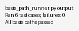

# Basis Path Testing Report

## Task
Implement a test harness that exercises all linearly independent paths of a small program (triangle classifier) using Basis Path Testing. Inputs are read from a file, actual outputs written to a file, compared with expected outputs, and results reported.

## Testable Program (`triangle_program.py`)
```python
"""
Testable program for Basis Path Testing.
Implements triangle classification with several decision points to derive independent paths.
"""
from __future__ import annotations

from typing import Iterable


def classify_triangle(a: float, b: float, c: float) -> str:
    """Return a label for the triangle defined by sides a, b, c.

    Output labels:
    - INVALID_NONPOSITIVE: any side <= 0
    - INVALID_TRIANGLE_INEQUALITY: violates triangle inequality
    - EQUILATERAL
    - ISOSCELES
    - RIGHT_SCALENE
    - SCALENE
    """

    sides = (a, b, c)

    # Decision 1: guard against non-positive values
    if any(x <= 0 for x in sides):
        return "INVALID_NONPOSITIVE"

    x, y, z = sorted(sides)

    # Decision 2: triangle inequality
    if x + y <= z:
        return "INVALID_TRIANGLE_INEQUALITY"

    # Decision 3: equilateral
    if a == b == c:
        return "EQUILATERAL"

    # Decision 4: isosceles (non-equilateral because of previous check)
    is_iso = a == b or b == c or a == c

    # Decision 5: right triangle (Pythagoras)
    is_right = abs(x * x + y * y - z * z) < 1e-9

    if is_iso:
        return "ISOSCELES"

    if is_right:
        return "RIGHT_SCALENE"

    return "SCALENE"


def classify_batch(rows: Iterable[dict[str, str]]) -> list[tuple[str, str]]:
    """Classify each row read from CSV and return list of (case_id, label)."""
    results: list[tuple[str, str]] = []
    for row in rows:
        case_id = row["case_id"]
        a, b, c = (float(row["a"]), float(row["b"]), float(row["c"]))
        label = classify_triangle(a, b, c)
        results.append((case_id, label))
    return results


if __name__ == "__main__":
    import csv
    import pathlib

    data_path = pathlib.Path("data/input.csv")
    with data_path.open(newline="") as f:
        reader = csv.DictReader(f)
        batch_results = classify_batch(reader)

    for case_id, label in batch_results:
        print(f"{case_id}: {label}")
```

## Testing Program (`basis_path_runner.py`)
```python
"""Testing harness that demonstrates Basis Path Testing for `triangle_program.py`.

Steps performed:
1. Read input test vectors from data/input.csv.
2. Compute actual labels via classify_triangle.
3. Write actual outputs to results/actual.csv.
4. Compare against expected labels (data/expected.csv).
5. Produce a human-friendly report in results/report.txt and print a summary.

Independent paths (derived from cyclomatic complexity V(G)=5 decisions + 1 = 6):
P1 invalid because a side is non-positive.
P2 invalid because triangle inequality fails.
P3 equilateral triangle.
P4 isosceles (but not equilateral).
P5 right, non-isosceles triangle.
P6 scalene, non-right triangle.
"""
from __future__ import annotations

import csv
import pathlib
from typing import Dict, Tuple

from triangle_program import classify_batch

INPUT_FILE = pathlib.Path("data/input.csv")
EXPECTED_FILE = pathlib.Path("data/expected.csv")
ACTUAL_FILE = pathlib.Path("results/actual.csv")
REPORT_FILE = pathlib.Path("results/report.txt")


def load_expected() -> Dict[str, str]:
    expected: Dict[str, str] = {}
    with EXPECTED_FILE.open(newline="") as f:
        reader = csv.DictReader(f)
        for row in reader:
            expected[row["case_id"]] = row["expected"]
    return expected


def write_actual(results: list[Tuple[str, str]]) -> None:
    ACTUAL_FILE.parent.mkdir(parents=True, exist_ok=True)
    with ACTUAL_FILE.open("w", newline="") as f:
        writer = csv.writer(f)
        writer.writerow(["case_id", "actual"])
        writer.writerows(results)


def compare(results: list[Tuple[str, str]], expected: Dict[str, str]) -> Tuple[int, list[str]]:
    mismatches: list[str] = []
    for case_id, actual in results:
        exp = expected.get(case_id, "<missing>")
        if actual != exp:
            mismatches.append(f"{case_id}: expected {exp}, got {actual}")
    return len(mismatches), mismatches


def write_report(total: int, failures: int, mismatches: list[str]) -> None:
    REPORT_FILE.parent.mkdir(parents=True, exist_ok=True)
    with REPORT_FILE.open("w") as f:
        f.write(f"Total cases: {total}\n")
        f.write(f"Failures: {failures}\n")
        if mismatches:
            f.write("\nMismatch details:\n")
            for line in mismatches:
                f.write(f"- {line}\n")


def main() -> None:
    with INPUT_FILE.open(newline="") as f:
        rows = list(csv.DictReader(f))

    expected = load_expected()
    results = classify_batch(rows)
    write_actual(results)

    failures, mismatches = compare(results, expected)
    write_report(total=len(results), failures=failures, mismatches=mismatches)

    print(f"Ran {len(results)} test cases; failures: {failures}")
    if mismatches:
        print("Mismatches:")
        for line in mismatches:
            print(f"  {line}")
    else:
        print("All basis paths passed.")


if __name__ == "__main__":
    main()
```

## Basis Path Analysis
- Cyclomatic complexity V(G) = E - N + 2 for a single connected component; from the 5 decision points in `classify_triangle` → V(G)=6 independent paths.
- Identified paths:
  - P1: non-positive side → INVALID_NONPOSITIVE
  - P2: triangle inequality fails → INVALID_TRIANGLE_INEQUALITY
  - P3: equilateral → EQUILATERAL
  - P4: isosceles (non-equilateral) → ISOSCELES
  - P5: right scalene → RIGHT_SCALENE
  - P6: scalene non-right → SCALENE

## Test Data
`data/input.csv` and `data/expected.csv` contain one row per path:
```
case_id,a,b,c,expected
P1,0,3,4,INVALID_NONPOSITIVE
P2,1,2,3,INVALID_TRIANGLE_INEQUALITY
P3,5,5,5,EQUILATERAL
P4,5,5,6,ISOSCELES
P5,3,4,5,RIGHT_SCALENE
P6,4,6,7,SCALENE
```

## Execution & Results
- Command: `python3 basis_path_runner.py`
- Artifacts: `results/actual.csv`, `results/report.txt`, `results/run_output.txt`, `results/run_output.png`.
- Summary from report: 6 total cases, 0 failures.

### Screenshot


## Steps Performed (Basis Path Testing)
1. Determine control flow and decisions in `classify_triangle`.
2. Compute cyclomatic complexity to know the minimum number of paths.
3. Enumerate linearly independent paths (P1–P6).
4. Design concrete test inputs to force traversal of each path.
5. Build harness to read inputs, execute program, capture actual outputs, and compare to expected.
6. Run tests, inspect mismatches (none), and store artifacts.

## Conclusions
**Advantages**
- Guarantees coverage of all linearly independent paths with a minimal set of tests.
- Exposes logical defects tied to specific decision combinations early.
- Produces a clear mapping between control-flow paths and test cases, aiding traceability.

**Disadvantages**
- Path enumeration grows quickly with added decisions; can become impractical for large programs.
- Focuses on control flow, not data flow; may miss defects tied to specific value interactions beyond the chosen paths.
- Requires an accurate control-flow model; refactoring or minor changes can invalidate the path set and test data.
